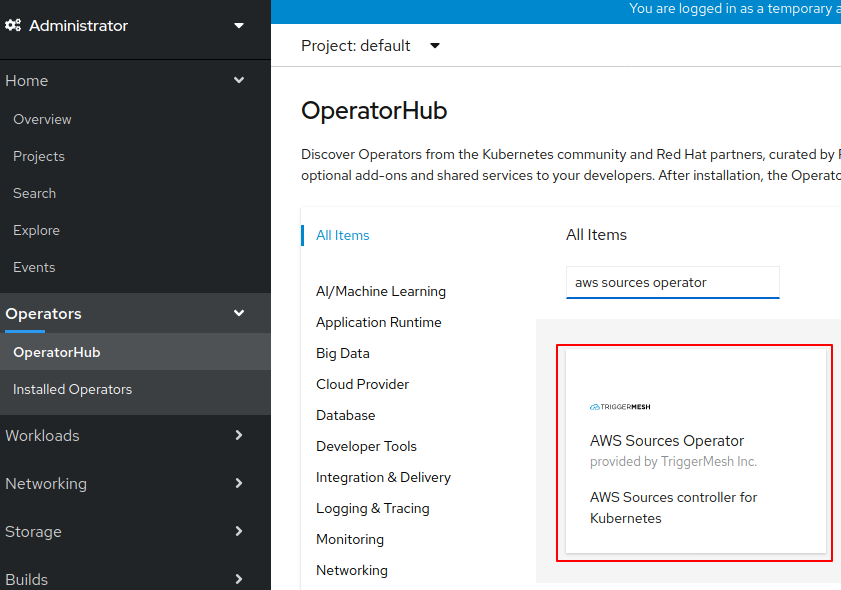
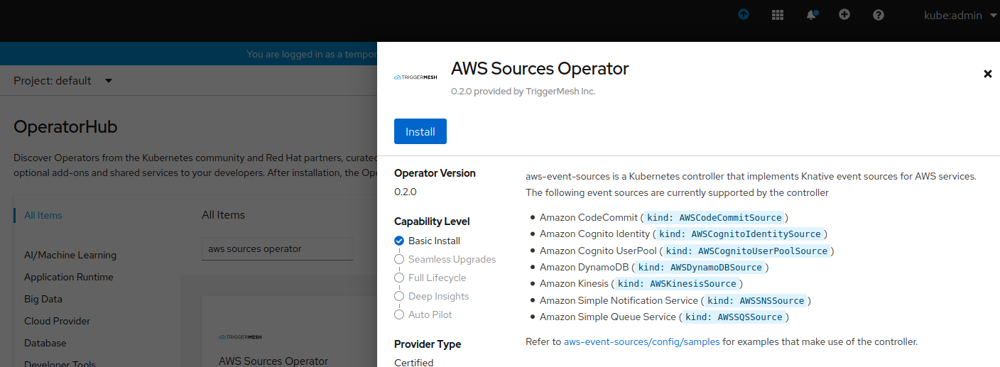
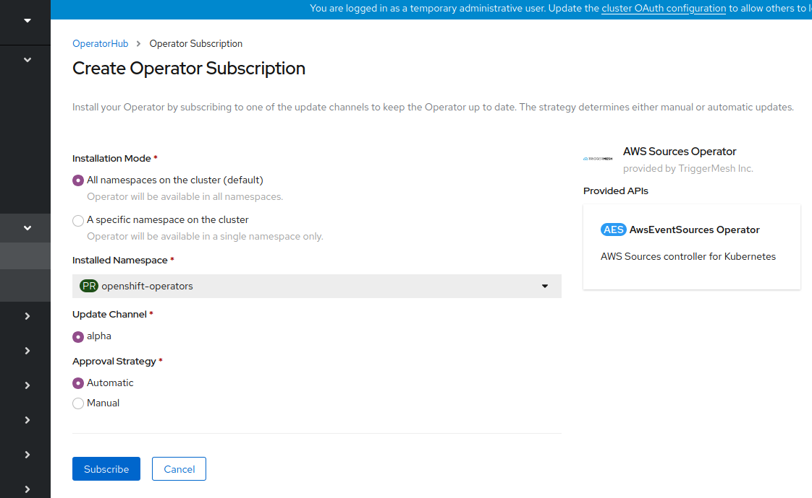
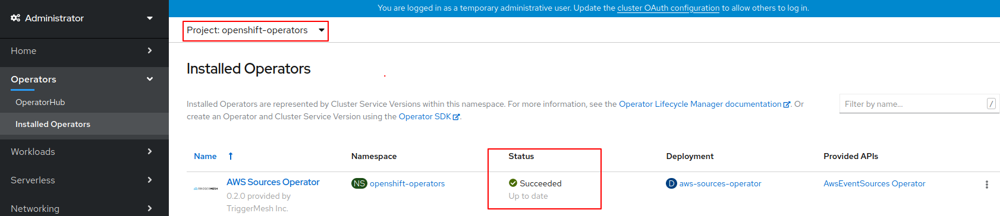
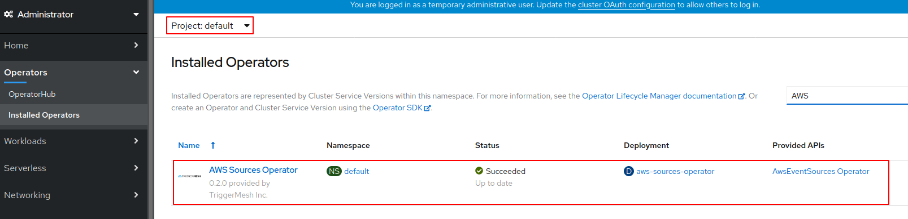
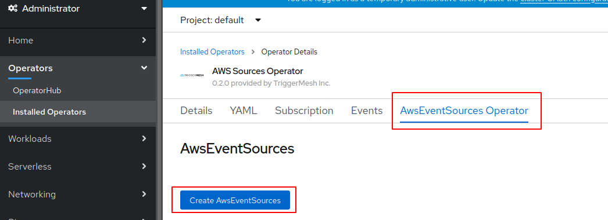
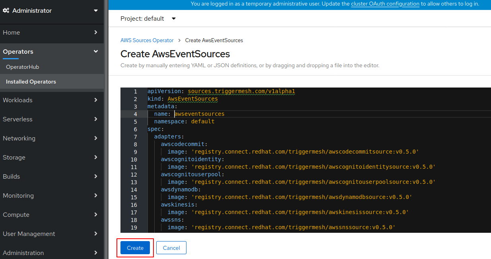

# AWS Event Sources Operator

TriggerMesh Sources for Amazon Web Services (SAWS) enables you to quickly and easily consume events that happen in your AWS services and send them to workloads running in your cluster.

This guide aims to getting you up and running with the operator on Openshift.

## Pre-requisites

The TriggerMesh AWS Event Sources require the Knative API's. Before the operator can be installed to the cluster, you need to first install the **OpenShift Serverless Operator**. Follow the [OpenShift Serverless Guide](https://access.redhat.com/documentation/en-us/openshift_container_platform/4.3/html/serverless_applications/installing-openshift-serverless-1) for installation instructions.

## Installing the AWS Event Sources Operator

1. Login to the OpenShift Container Platform console
2. Navigate to **Operators > OperatorHub** and search for **AWS Sources Operator**

3. Review the information about the Operator and click **Install**

4. On the Create Operator Subscription page, review the options and click **Subscribe**

#### Verification

Switch to the `openshift-operators` project and navigate to the **Operators > Installed Operators** page. If the installation went as expected, the **Status** should resolve to **Succeeded**.

At the **Workloads > Pods** page you can look up the status of the pods and also inspect the pod logs in order to troubleshoot any issues.

## Install the AWS Event Sources Controller

After you install the AWS Event Sources Operator, you can install the AWS Event Sources Controller

1. Switch to the `default` project

2. Navigate to **Operators > Installed Operators > AWS Sources Operator** and go to the **AwsEventSources** tab

   

3. Click the **Create AwsEventSources** button

   

4. In the **Create AwsEventSources** page, you can install AWS Event Sources using the default settings by clicking **Create**

   

#### Verification

1. Click on `awseventsource` in the **AwsEventSources** tab
2. In the **AwsEventSources Operator Overview** page, scroll down to look at the list of **Conditions**
3. The status of the **Deployed** condition should eventually change to `InstallSuccessful`
4. At the **Workloads > Pods** page you can look up the status of the pods and also inspect the pod logs in order to troubleshoot any issues.

This concludes the guide for getting up and running with the AWS Event Sources Operator by TriggerMesh.

### Next Steps

Learn how you can use [AWS Event Sources by TriggerMesh](https://github.com/triggermesh/aws-event-sources/) to integrate events from AWS to workloads on a OpenShift cluster.
